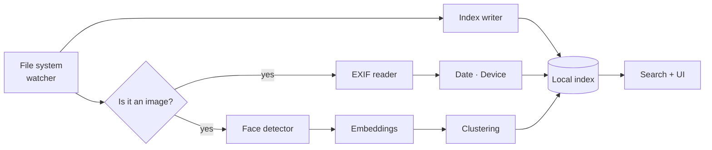

<<<<<<< HEAD
<div align="center">


# PiFiles

**A file manager that actually keeps up with you.**

Instant search, on-device photo intelligence, and a launch time measured in milliseconds — not coffee breaks.

[](https://github.com/YOUR_USERNAME/pifiles/releases)
[](LICENSE)
[](#installation)
[](https://github.com/YOUR_USERNAME/pifiles/stargazers)

[Install](#installation) · [Features](#features) · [How it works](#how-it-works) · [Configuration](#configuration) · [Roadmap](#roadmap)

</div>

---

<div align="center">

<br />
<sub><i>Replace with a real capture — a 10–15s GIF of search + photo grouping sells this better than any paragraph.</i></sub>
</div>

---

## Why PiFiles

Most file managers were designed when a photo library meant a few hundred JPEGs in a folder called `New Folder (2)`. PiFiles is built for the reality: tens of thousands of files, half of them photos, none of them named anything useful.

It does three things well.

| | |
|---|---|
| ⚡ **Finds things instantly** | An incremental index means results appear as you type — no spinner, no "searching C:\\..." status bar. |
| 🖼 **Organizes photos by itself** | Groups by the people in them, when they were taken, and which device took them. All on your machine. |
| 🪶 **Stays out of the way** | Cold start in well under a second, a UI that never blocks on I/O, and a design that doesn't look like it shipped in 2009. |

---

## Features

### Search that keeps pace with typing

- **Incremental indexing** — the index updates as the filesystem changes, so it's never stale and never needs a full rescan.
- **Fuzzy + prefix matching** — `rprt q3` finds `Q3_Report_final_FINAL.pdf`.
- **Filter syntax** — narrow by type, size, date, or location: `type:image taken:2024 device:iphone`.
- **Content-aware** — searches inside documents and photo metadata, not just filenames.

### Automated photo classification

PiFiles reads what's already in your photos and builds albums from it — no tagging, no manual sorting.

- **By person** — face detection and clustering groups every photo of the same person together. Name a cluster once and it applies retroactively across your whole library.
- **By date** — EXIF capture timestamps, with fallback to filesystem dates when metadata is missing or stripped.
- **By device** — camera make and model pulled from EXIF, so shots from your DSLR don't get lost among screenshots.
- **Smart collections** — the above combine freely: *photos of Anna, taken on the Canon, in 2023*.

> [!IMPORTANT]
> **Everything runs locally.** Face embeddings are computed on-device and stored in your local index. No photo, thumbnail, or embedding is uploaded anywhere. There is no account and no telemetry.

### Built for speed

- **Sub-second cold start** — the window paints before the index finishes loading.
- **Non-blocking UI** — indexing, thumbnailing, and classification all run off the render thread. Scrolling stays smooth during a full library scan.
- **Virtualized rendering** — a folder with 50,000 items renders as fast as one with 50.
- **Lazy thumbnails** — generated on demand, cached to disk, resolved progressively.

### Modern interface

- Light and dark themes that follow your system preference
- Adaptive layout — grid, list, and detail views that respond to window size
- Full keyboard navigation and a command palette (<kbd>Ctrl</kbd>/<kbd>Cmd</kbd> + <kbd>K</kbd>)
- Tabs, split panes, and drag-and-drop between them

---

## Screenshots

<div align="center">
<table>
<tr>
<td width="50%"><br /><sub align="center">Instant search</sub></td>
<td width="50%"><br /><sub align="center">People view</sub></td>
</tr>
<tr>
<td><br /><sub>Photo grid</sub></td>
<td><br /><sub>Dark theme</sub></td>
</tr>
</table>
</div>

---

## Installation

### Windows

```powershell
winget install YOUR_USERNAME.PiFiles
```

Or grab the installer from the [releases page](https://github.com/YOUR_USERNAME/pifiles/releases).

### macOS

```bash
brew install --cask pifiles
```

### Linux

```bash
# Debian / Ubuntu
sudo dpkg -i pifiles_x.y.z_amd64.deb

# Arch
yay -S pifiles
```

### From source

```bash
git clone https://github.com/YOUR_USERNAME/pifiles.git
cd pifiles
# TODO: replace with your actual build commands
<install-deps>
<build-command>
```

**Requirements:** `TODO — runtime version, minimum RAM, GPU requirements (if any) for the face model.`

---

## Quick start

1. Launch PiFiles and point it at a folder to watch.
2. The initial index builds in the background — you can browse and search immediately while it does.
3. Open the **People** tab once classification finishes. Name a face cluster to label every photo in it at once.

That's the whole setup.

---

## How it works



A single filesystem watcher feeds every downstream consumer. Images branch into a metadata pass (EXIF for capture date and camera model) and a vision pass (face detection → embeddings → clustering). Results land in one local index that the UI queries synchronously, which is why search feels instant even mid-scan.

Deeper notes live in [`docs/architecture.md`](docs/architecture.md).

---

## Performance

> [!NOTE]
> Fill these in with your own measured numbers before publishing, and say what you measured on. Real numbers from a stated machine are far more persuasive than round ones.

| Metric | PiFiles | Baseline |
|---|---|---|
| Cold start | `—` | `—` |
| Search latency (100k files) | `—` | `—` |
| Initial index (10k photos) | `—` | `—` |
| Idle memory | `—` | `—` |

<sub>Measured on `TODO: CPU, RAM, storage type`. Reproduce with `TODO: benchmark command`.</sub>

---

## Configuration

Settings live in `TODO: config path` and can be edited directly.

```jsonc
{
  "watchedFolders": ["C:/Users/you/Pictures"],
  "search": {
    "indexFileContents": true,
    "excludePatterns": ["node_modules", ".git", "*.tmp"]
  },
  "classification": {
    "faces": true,
    "minFaceSize": 40,
    "clusterThreshold": 0.6,
    "groupByDevice": true
  },
  "ui": {
    "theme": "system",
    "defaultView": "grid"
  }
}
```

Full reference: [`docs/configuration.md`](docs/configuration.md).

---

## Keyboard shortcuts

| Action | Shortcut |
|---|---|
| Command palette | <kbd>Ctrl</kbd> + <kbd>K</kbd> |
| Focus search | <kbd>Ctrl</kbd> + <kbd>F</kbd> |
| New tab | <kbd>Ctrl</kbd> + <kbd>T</kbd> |
| Toggle view | <kbd>Ctrl</kbd> + <kbd>1</kbd> … <kbd>3</kbd> |
| Go up a directory | <kbd>Alt</kbd> + <kbd>↑</kbd> |
| Rename | <kbd>F2</kbd> |

---

## Roadmap

- [x] Incremental search index
- [x] EXIF date and device grouping
- [x] Face detection and clustering
- [ ] Duplicate and near-duplicate detection
- [ ] Location grouping from GPS EXIF
- [ ] Bulk rename with pattern templates
- [ ] Cloud storage mounts
- [ ] Plugin API

Have an idea? [Open an issue](https://github.com/YOUR_USERNAME/pifiles/issues).

---

## Contributing

Contributions are welcome. Please open an issue before starting on anything substantial so we don't duplicate work.

```bash
git clone https://github.com/YOUR_USERNAME/pifiles.git
cd pifiles
<install-deps>
<run-dev>
<run-tests>
```

See [`CONTRIBUTING.md`](CONTRIBUTING.md) for coding standards and PR conventions.

---

## Privacy

PiFiles is offline by design.

- Face embeddings never leave your machine
- No account, no sign-in, no cloud sync
- No analytics or crash telemetry
- The index is stored locally and can be deleted at any time from Settings → Storage

---

## License

`TODO` — see [LICENSE](LICENSE).

---

<div align="center">
<sub>Built by <a href="https://github.com/YOUR_USERNAME">YOUR_NAME</a> · If PiFiles saves you time, a ⭐ helps others find it.</sub>
=======
<div align="center">


# PiFiles

**A file manager that actually keeps up with you.**

Instant search, on-device photo intelligence, and a launch time measured in milliseconds — not coffee breaks.

[](https://github.com/YOUR_USERNAME/pifiles/releases)
[](LICENSE)
[](#installation)
[](https://github.com/YOUR_USERNAME/pifiles/stargazers)

[Install](#installation) · [Features](#features) · [How it works](#how-it-works) · [Configuration](#configuration) · [Roadmap](#roadmap)

</div>

---

<div align="center">

<br />
<sub><i>Replace with a real capture — a 10–15s GIF of search + photo grouping sells this better than any paragraph.</i></sub>
</div>

---

## Why PiFiles

Most file managers were designed when a photo library meant a few hundred JPEGs in a folder called `New Folder (2)`. PiFiles is built for the reality: tens of thousands of files, half of them photos, none of them named anything useful.

It does three things well.

| | |
|---|---|
| ⚡ **Finds things instantly** | An incremental index means results appear as you type — no spinner, no "searching C:\\..." status bar. |
| 🖼 **Organizes photos by itself** | Groups by the people in them, when they were taken, and which device took them. All on your machine. |
| 🪶 **Stays out of the way** | Cold start in well under a second, a UI that never blocks on I/O, and a design that doesn't look like it shipped in 2009. |

---

## Features

### Search that keeps pace with typing

- **Incremental indexing** — the index updates as the filesystem changes, so it's never stale and never needs a full rescan.
- **Fuzzy + prefix matching** — `rprt q3` finds `Q3_Report_final_FINAL.pdf`.
- **Filter syntax** — narrow by type, size, date, or location: `type:image taken:2024 device:iphone`.
- **Content-aware** — searches inside documents and photo metadata, not just filenames.

### Automated photo classification

PiFiles reads what's already in your photos and builds albums from it — no tagging, no manual sorting.

- **By person** — face detection and clustering groups every photo of the same person together. Name a cluster once and it applies retroactively across your whole library.
- **By date** — EXIF capture timestamps, with fallback to filesystem dates when metadata is missing or stripped.
- **By device** — camera make and model pulled from EXIF, so shots from your DSLR don't get lost among screenshots.
- **Smart collections** — the above combine freely: *photos of Anna, taken on the Canon, in 2023*.

> [!IMPORTANT]
> **Everything runs locally.** Face embeddings are computed on-device and stored in your local index. No photo, thumbnail, or embedding is uploaded anywhere. There is no account and no telemetry.

### Built for speed

- **Sub-second cold start** — the window paints before the index finishes loading.
- **Non-blocking UI** — indexing, thumbnailing, and classification all run off the render thread. Scrolling stays smooth during a full library scan.
- **Virtualized rendering** — a folder with 50,000 items renders as fast as one with 50.
- **Lazy thumbnails** — generated on demand, cached to disk, resolved progressively.

### Modern interface

- Light and dark themes that follow your system preference
- Adaptive layout — grid, list, and detail views that respond to window size
- Full keyboard navigation and a command palette (<kbd>Ctrl</kbd>/<kbd>Cmd</kbd> + <kbd>K</kbd>)
- Tabs, split panes, and drag-and-drop between them

---

## Screenshots

<div align="center">
<table>
<tr>
<td width="50%"><br /><sub align="center">Instant search</sub></td>
<td width="50%"><br /><sub align="center">People view</sub></td>
</tr>
<tr>
<td><br /><sub>Photo grid</sub></td>
<td><br /><sub>Dark theme</sub></td>
</tr>
</table>
</div>

---

## Installation

### Windows

```powershell
winget install YOUR_USERNAME.PiFiles
```

Or grab the installer from the [releases page](https://github.com/YOUR_USERNAME/pifiles/releases).

### macOS

```bash
brew install --cask pifiles
```

### Linux

```bash
# Debian / Ubuntu
sudo dpkg -i pifiles_x.y.z_amd64.deb

# Arch
yay -S pifiles
```

### From source

```bash
git clone https://github.com/YOUR_USERNAME/pifiles.git
cd pifiles
# TODO: replace with your actual build commands
<install-deps>
<build-command>
```

**Requirements:** `TODO — runtime version, minimum RAM, GPU requirements (if any) for the face model.`

---

## Quick start

1. Launch PiFiles and point it at a folder to watch.
2. The initial index builds in the background — you can browse and search immediately while it does.
3. Open the **People** tab once classification finishes. Name a face cluster to label every photo in it at once.

That's the whole setup.

---

## How it works


A single filesystem watcher feeds every downstream consumer. Images branch into a metadata pass (EXIF for capture date and camera model) and a vision pass (face detection → embeddings → clustering). Results land in one local index that the UI queries synchronously, which is why search feels instant even mid-scan.

Deeper notes live in [`docs/architecture.md`](docs/architecture.md).

---

## Performance

> [!NOTE]
> Fill these in with your own measured numbers before publishing, and say what you measured on. Real numbers from a stated machine are far more persuasive than round ones.

| Metric | PiFiles | Baseline |
|---|---|---|
| Cold start | `—` | `—` |
| Search latency (100k files) | `—` | `—` |
| Initial index (10k photos) | `—` | `—` |
| Idle memory | `—` | `—` |

<sub>Measured on `TODO: CPU, RAM, storage type`. Reproduce with `TODO: benchmark command`.</sub>

---

## Configuration

Settings live in `TODO: config path` and can be edited directly.

```jsonc
{
  "watchedFolders": ["C:/Users/you/Pictures"],
  "search": {
    "indexFileContents": true,
    "excludePatterns": ["node_modules", ".git", "*.tmp"]
  },
  "classification": {
    "faces": true,
    "minFaceSize": 40,
    "clusterThreshold": 0.6,
    "groupByDevice": true
  },
  "ui": {
    "theme": "system",
    "defaultView": "grid"
  }
}
```

Full reference: [`docs/configuration.md`](docs/configuration.md).

---

## Keyboard shortcuts

| Action | Shortcut |
|---|---|
| Command palette | <kbd>Ctrl</kbd> + <kbd>K</kbd> |
| Focus search | <kbd>Ctrl</kbd> + <kbd>F</kbd> |
| New tab | <kbd>Ctrl</kbd> + <kbd>T</kbd> |
| Toggle view | <kbd>Ctrl</kbd> + <kbd>1</kbd> … <kbd>3</kbd> |
| Go up a directory | <kbd>Alt</kbd> + <kbd>↑</kbd> |
| Rename | <kbd>F2</kbd> |

---

## Roadmap

- [x] Incremental search index
- [x] EXIF date and device grouping
- [x] Face detection and clustering
- [ ] Duplicate and near-duplicate detection
- [ ] Location grouping from GPS EXIF
- [ ] Bulk rename with pattern templates
- [ ] Cloud storage mounts
- [ ] Plugin API

Have an idea? [Open an issue](https://github.com/YOUR_USERNAME/pifiles/issues).

---

## Contributing

Contributions are welcome. Please open an issue before starting on anything substantial so we don't duplicate work.

```bash
git clone https://github.com/YOUR_USERNAME/pifiles.git
cd pifiles
<install-deps>
<run-dev>
<run-tests>
```

See [`CONTRIBUTING.md`](CONTRIBUTING.md) for coding standards and PR conventions.

---

## Privacy

PiFiles is offline by design.

- Face embeddings never leave your machine
- No account, no sign-in, no cloud sync
- No analytics or crash telemetry
- The index is stored locally and can be deleted at any time from Settings → Storage

---

## License

`TODO` — see [LICENSE](LICENSE).

---

<div align="center">
<sub>Built by <a href="https://github.com/YOUR_USERNAME">YOUR_NAME</a> · If PiFiles saves you time, a ⭐ helps others find it.</sub>
>>>>>>> 324dc1c (Initial)
</div>